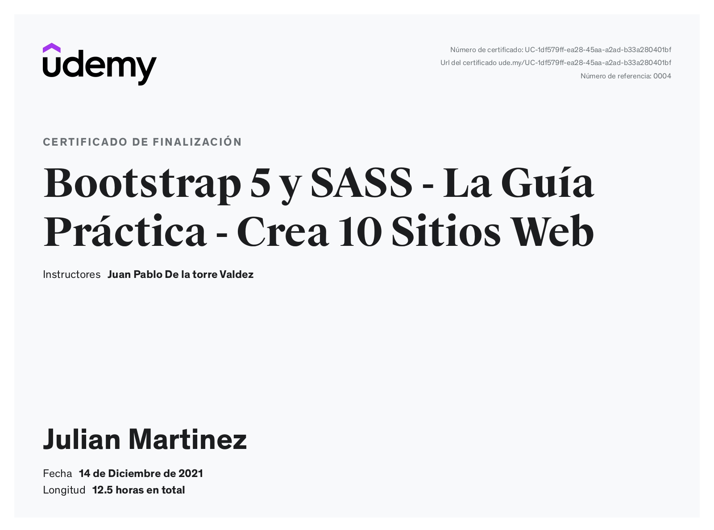
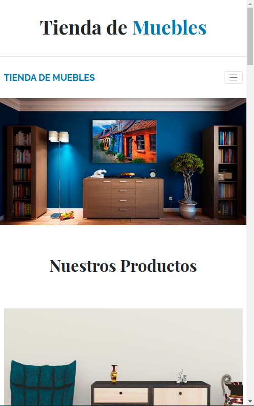
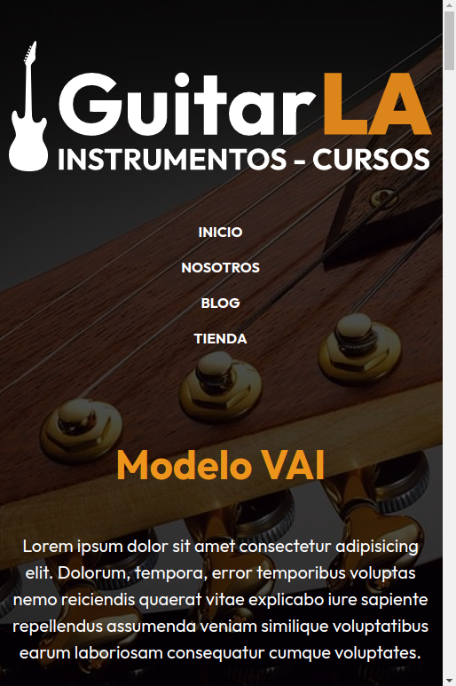

<h1>Curso de Bootstrap 5 y Sass - La guia práctica</h1>
 <h2>Estoy muy contento de informarte que he finalizado mi curso de Bootstrap 5 y Sass</h2>

</img>

En el curso aprendi desde menor a mayor como crear sitios 100% responsives con el framework Bootstrap y a personalizarlo mediante el uso de Sass, creando varios sitios web a los cuales vas a poder acceder tanto al deployment como al codigo desarrollado en los enlaces que te dejare a continuacion. 

<h2>Algunos proyectos de practica realizados</h2>

<h3>E-commerce:Tienda de Muebles</h3>
   
    
  
  
Proyecto de e-commerce, solamente usando bootstrap, html, css y javascript.

  
  <h4>Links</h4>
  <ul>
   <li>
      Repositorio de Github: https://github.com/julianmartinez-dev/ecommerce_bs
  </li>
  <li>
     Deployment Github Pages: https://julianmartinez-dev.github.io/ecommerce_bs/
  </li>
  </ul>
 
 

 
 <h3>Landing Page - Podcast FM</h3>
   
    
  
  
Proyecto realizado con bootstrap personalizado en Sass.

  Workflow creado mediante Gulp y distintas dependencias.
  
  <h4>Links</h4>
  <ul>
   <li>
      Repositorio de Github: https://github.com/julianmartinez-dev/podcastfm
  </li>
  <li>
     Deployment Netlify: https://podcastfm-practica.netlify.app/
  </li>
  </ul>
  
  

 
 <h3>Clon de Udemy - Front Page!</h3>
   
    
  
  
Proyecto realizado con bootstrap personalizado en Sass.

  Workflow creado mediante Gulp y distintas dependencias.
  
  <h4>Links</h4>
  <ul>
   <li>
      Repositorio de Github: https://github.com/julianmartinez-dev/udemyfrontpage
  </li>
  <li>
     Deployment Github Pages: https://julianmartinez-dev.github.io/udemyfrontpage/
  </li>
  </ul>
  
  

 
 <h3>E-commerce: Tienda de guitarras</h3>
   
    
  
  
Proyecto realizado con bootstrap personalizado en Sass.

  Workflow creado mediante Gulp y distintas dependencias.
  
  <h4>Links</h4>
  <ul>
   <li>
      Repositorio de Github: https://github.com/julianmartinez-dev/tiendadeguitarras
  </li>
  <li>
     Deployment Github Pages: https://julianmartinez-dev.github.io/tiendadeguitarras/
  </li>
  </ul>
 
<h2>Links de interes</h2>
<ul>
   <li>
     Repositorio al archivo de "gulpfile" para la optimizacion del workflow: <a href = "https://github.com/julianmartinez-dev/gulpfile-1/blob/main/gulpfile.js"><b>Aqui</b></a>
  </li>
  <li>
    Sitio web del instructor: <a href="https://codigoconjuan.com"><b>Aqui</b></a>
  </li>
    <li>
    Enlace al curso de "Bootstrap 5 y Sass": <a href="https://www.udemy.com/course/aprende-bootstrap-4-el-framework-responsive-html5-css3-y-js/"><b>Aqui</b></a>
  </li>
  </ul>

